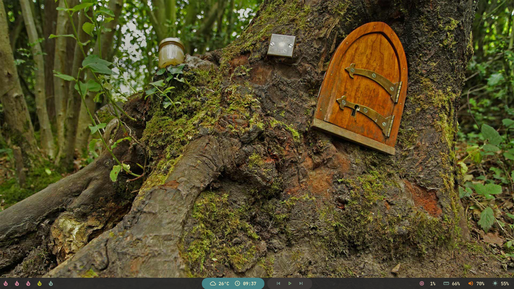

# bspwm dotfiles

My personal bspwm dotfiles, for now I'm using the Material theme.

## I keep everything separate, here's my collection of themes and wallpapers

* [Polybar Collection](https://github.com/Murzchnvok/polybar-collection)
* [Rofi Collection](https://github.com/Murzchnvok/rofi-collection)
* [Wallpaper Collection](https://drive.google.com/drive/folders/1o1qjRgkJtnF_8uGB1z6MRsQUjWinHUsw?usp=sharing)

## GTK and Icon Theme

* [Materia Dark](https://github.com/nana-4/materia-theme)
* [Papirus](https://github.com/PapirusDevelopmentTeam/papirus-icon-theme)
* [Papirus Folders](https://github.com/PapirusDevelopmentTeam/papirus-folders)

