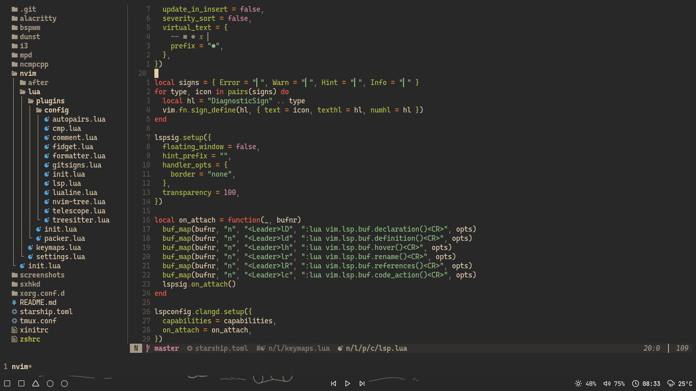

# My dotfiles

My personal dotfiles. Using [Gruvbox](https://github.com/morhetz/gruvbox), my favorite for sure!

## Themes & the rest

- [GTK Theme](https://github.com/Fausto-Korpsvart/Gruvbox-GTK-Theme)
- [Icon Theme](https://github.com/PapirusDevelopmentTeam/papirus-icon-theme)
- [Papirus Folders (brown)](https://github.com/PapirusDevelopmentTeam/papirus-folders)

## Check it out my collections

- [nvim config](https://github.com/Murzchnvok/nvim)
- [Polybar Collection](https://github.com/Murzchnvok/polybar-collection)
- [Rofi Collection](https://github.com/Murzchnvok/rofi-collection)
- [Wallpaper Collection](https://drive.google.com/drive/folders/1o1qjRgkJtnF_8uGB1z6MRsQUjWinHUsw?usp=sharing)
